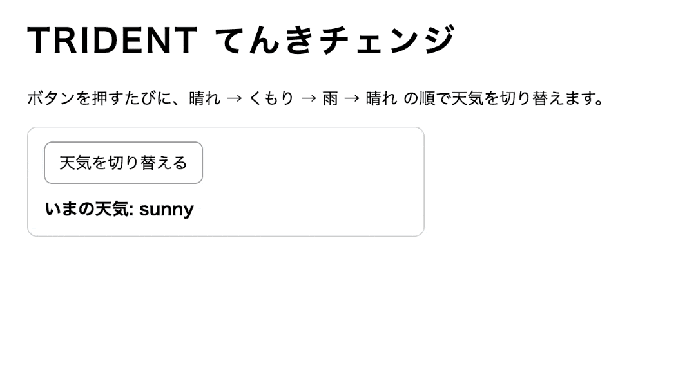

# jsQuiz-neo-11

React CDN（esm.sh + Babel）で進める、`useState` 入門問題です。
`students/{番号}/index.html` で、天気チェンジを完成させます。

## JavaScriptクイズNEO ⑪

下記のリポジトリからフォーク → クローン → ブランチ作成 → 編集 → コミット → プッシュ → プルリクエストで提出してください。
今回は **GitHub Desktopを使わず、CUI（ターミナルのgitコマンド）** で提出まで行います。
VS Codeのターミナルで進めましょう。

- https://github.com/kawaguchi-trident/jsQuiz-neo-11

## 課題内容

`WeatherSwitcher` コンポーネントの `return null;` を、`useState` で動く JSX に書き換えてください。

- 初期表示：`いまの天気: sunny`
- `.weather-btn` を押すたびに `sunny -> cloudy -> rainy -> sunny` の順で切り替わる
- `.weather-label` に `いまの天気: {weather}` を表示

用意済みの `const [weather, setWeather] = useState('sunny');` は消さないでください。

### 完成イメージ



## 接続方式（HTTPS / SSH）を確認する

GitHubと通信する方式には **HTTPS** と **SSH** の2種類があり、どちらが使える状態かはPCの設定によって違います。
cloneの前に、ターミナルで自分の環境を確認します。

```bash
ssh -T git@github.com
```

- `Hi ユーザー名! You've successfully authenticated, ...` と表示された → **SSH** で進めます
- `Permission denied` と出た・応答がない → **HTTPS** で進めます（GitHub Desktopを使ってきた人は、HTTPSの認証が済んでいることが多いです）

## 提出フロー

### 1. Fork（ブラウザ）

`jsQuiz-neo-11` を自分のアカウントにForkしてください。

### 2. clone（ターミナル）

Forkした自分のリポジトリの **<> Code** ボタンからURLをコピーします。
**HTTPS / SSH のタブが、先ほど確認した方式になっているか** を見てからコピーしてください。

```bash
# HTTPSの場合
git clone https://github.com/<自分のアカウント>/jsQuiz-neo-11.git

# SSHの場合
git clone git@github.com:<自分のアカウント>/jsQuiz-neo-11.git

cd jsQuiz-neo-11
```

### 3. branchを作る

ブランチ名は `quiz11/自分の名前` です（例：`quiz11/kawaguchi`）。

```bash
git switch -c quiz11/kawaguchi
```

### 4. コードを書く

`students/{自分の番号}/index.html` を編集して課題を完成させます。
（例：出席番号が 7 番なら `students/7/index.html`）

ルートの `index.html` を `students/{自分の番号}/index.html` にコピーしてから編集するのが簡単です。

### 5. commit / push（ターミナル）

`-m` を2つ書くと、1つ目がtitle（出席番号\_名前）、2つ目がmessageになります。
初回のpushは `-u origin ブランチ名` を付けて、リモートと紐付けます。

```bash
git add .
git commit -m "28_河口" -m "提出します。"
git push -u origin quiz11/kawaguchi
```

### 6. Pull Requestを作成（ブラウザ）

- ターミナル内にリンクが表示されるので、リンクをクリックする。
- Pull Request画面が表示されるので、元のリポジトリに向けてPull Requestを作成してください。
- Webブラウザで行います。

## 判定について

- Pull Request を出すと GitHub Actions が自動判定します
- 成功すると PR に `✅ 合格！` コメントが付きます
- 失敗すると PR に `❌ 不合格` コメントと確認ポイントが付きます

## 注意

- 編集するのは `students/{自分の番号}/index.html` のみ
- `<script>` 内の「ここから下があなたの課題です」〜「ここまでがあなたの課題です」の間だけを編集
- import map / React import / `App` / `createRoot` / 自動判定用コードは書き換えない
